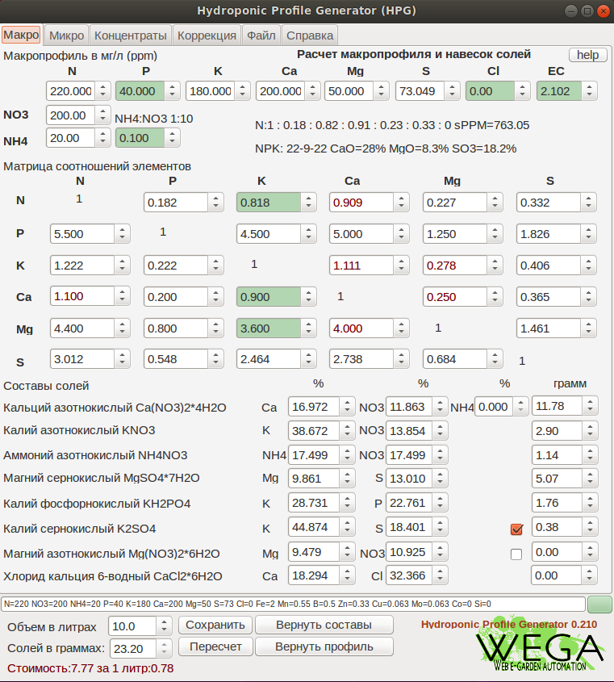
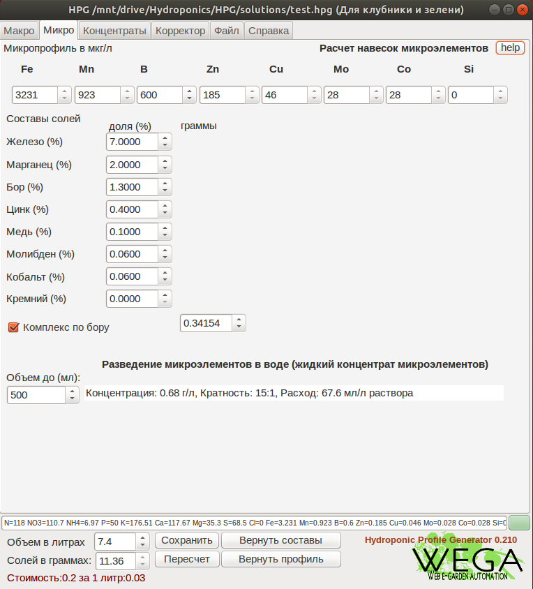
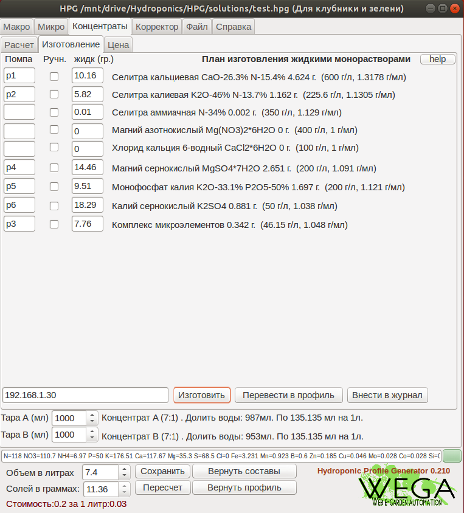

# Калькулятор HPG

`Hydroponic Profile Generator` — комплексный инструмент для расчёта, коррекции и ведения профилей питания в гидропонике.

  
  &emsp;
  
  &emsp;
  

---

## Быстрый доступ

- **📘 Документация:** [Wiki HPG](https://github.com/WEGA-project/WEGA-HPG/wiki) — инструкции по настройкам, формулам и практическим сценариям.
- **🌐 Веб-калькулятор:** [HTML5-версия](https://wega-project.github.io/wega-hpg/hpg.html) — работает прямо в браузере.
- **📚 Портал профилей:** [wega-hpg/portal](https://wega-project.github.io/wega-hpg/portal/) — берите готовые рецепты, делитесь своими, смотрите журналы и галереи.

---

## 📥 Скачать калькулятор

- **🐧 Linux x86_64:** [скачать бинарник](https://github.com/WEGA-project/WEGA-HPG/raw/master/hpg)
- **🪟 Windows:** [скачать .exe](https://github.com/WEGA-project/WEGA-HPG/raw/master/hpg.exe)
- **📦 Полный архив:** [master.zip](https://github.com/WEGA-project/WEGA-HPG/archive/refs/heads/master.zip)
- **📋 Примеры профилей:** [examples.zip](https://github.com/WEGA-project/wega-hpg/blob/master/examples.zip)

---

## Навигация

- [Зачем нужен HPG](#overview)
- [Что умеет](#features)
- [Каналы загрузки и сборка](#versions)
- [Как собрать под свою систему](#how_to_build)

---

## Зачем нужен HPG 

Приложение помогает проектировать минеральное питание растений, сравнивать профили и вести протоколы выращивания. В основе — баланс элементов `NPKCaMgSCl` с учётом ионов и совместимости солей.

- Гибкая настройка макро- и микро-профилей.
- Визуальное управление соотношениями и навесками.
- История изменений, корректоры, обмен профилями.

Больше сценариев и инструкций — на [Wiki HPG](https://github.com/WEGA-project/WEGA-HPG/wiki).

---

## Что умеет 

- **Ионный баланс:** автоматический пересчёт соотношений `N`, `P`, `K`, `Ca`, `Mg`, `S`, `Cl`.
- **Концентраты A/B:** расчёт монорастворов, концентратов и контроль растворимости.
- **Микроэлементы:** покомпонентно и через комплексы с ограничением по бору.
- **Корректор раствора:** сценарии корректировки объёма и EC без полного перезапуска системы.
- **Журналы и история:** храните протоколы, версии профилей, следите за изменениями.
- **Интеграции:** обмен файлами `.hpg`, работа с миксером WEGA, портал профилей.

И это лишь базовый набор — остальные возможности разбираем в руководствах на wiki.

---

## Каналы загрузки и сборка 

| Канал | Где взять | Для чего |
|-------|-----------|---------|
| Веб-версия | [wega-project.github.io/wega-hpg/hpg.html](https://wega-project.github.io/wega-hpg/hpg.html) | Быстрый старт без установки |
| Linux | [hpg (x86_64)](https://github.com/WEGA-project/WEGA-HPG/raw/master/hpg) | Натívный бинарник для Linux |
| Windows | [hpg.exe](https://github.com/WEGA-project/WEGA-HPG/raw/master/hpg.exe) | Готовый исполняемый файл |
| Архив | [master.zip](https://github.com/WEGA-project/WEGA-HPG/archive/refs/heads/master.zip) | Полный репозиторий |
| Примеры | [examples.zip](https://github.com/WEGA-project/wega-hpg/blob/master/examples.zip) | Готовые профили питания |

---

## Как собрать калькулятор под свою систему 

1. **Скачать исходники:** возьмите свежий архив или клоните репозиторий.
2. **Установить Lazarus:** [скачать IDE](https://www.lazarus-ide.org/index.php?page=downloads) и поставить все компоненты.
3. **Открыть проект:** в Lazarus → `Проект → Открыть проект` → укажите директорию с исходниками.
4. **Собрать:** нажмите `F9` или зелёную стрелку. Полученный бинарник можно распространять без IDE.

> 💡 **Подсказка:** после сборки загляните на [Wiki HPG](https://github.com/WEGA-project/WEGA-HPG/wiki), чтобы настроить формы `Macro`, `Micro`, `Correction` и выбрать подходящие профили с портала.

---

Готовы к работе? Скачайте нужный канал, изучите wiki и присоединяйтесь к сообществу HPG.*** End Patch
