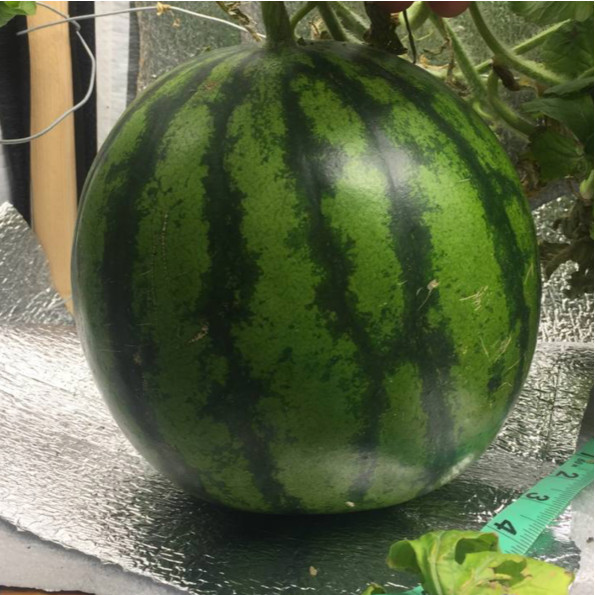
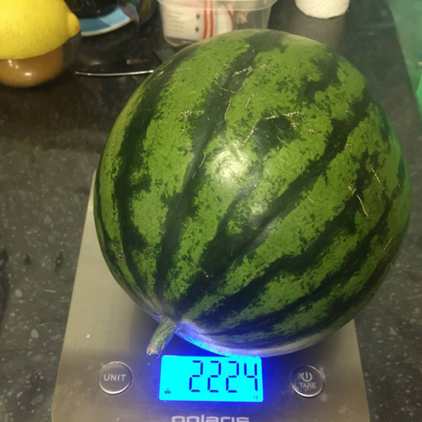
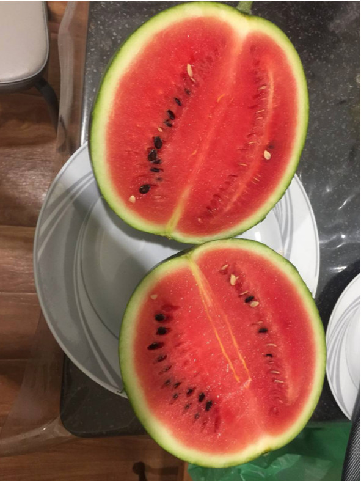
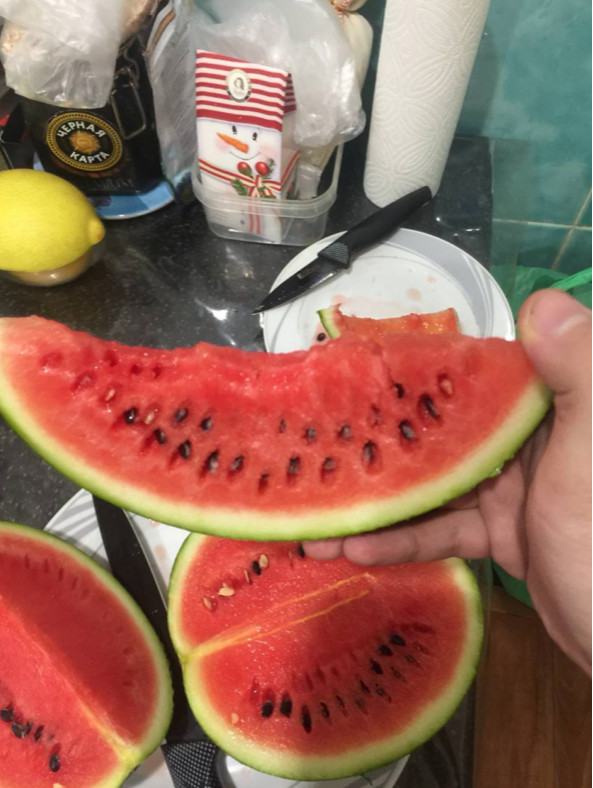

# Telegram: https://t.me/ponics_ru

### Используя этот профиль это не гарантия успеха, нужно понимать что вы делаете и как.

## Автор профиля
@Mikhail (Mikhail Tvauri)

## Сорт
*Соренто Ф1*

## Условия выращивания
Общий объем тары 20 литров, рабочий объем для раствора - 15 литров.  

Растил под 10 лампами лексманами на 24 Вт 3000 лм. 

Объем гроубокса 0.55 кв.м., всё обклеено пенофолом.  

### Посадка
Посадка прямо в керамзит на двц.

### Сбор
На 40 день после опыления арбуз полностью созрел.

## Где и как найти дополнительную информацию

Искать результат выращивания зелени на этом профиле в канале по имени автора.

## Проблемы
Основная проблема, которая была - это опыление. 

Так как женский цветок (с арбузиком) может опылиться только в первые пол дня, после раскрытия, то нужно, чтобы одновременно с ней раскрылся и мужской цветок, который фертилен также только в первый день раскрытия. 

Больше проблем каких-то не наблюдалось, растение росло легко и хорошо.

## Фото
<a href="img/1.jpg">

</a>

