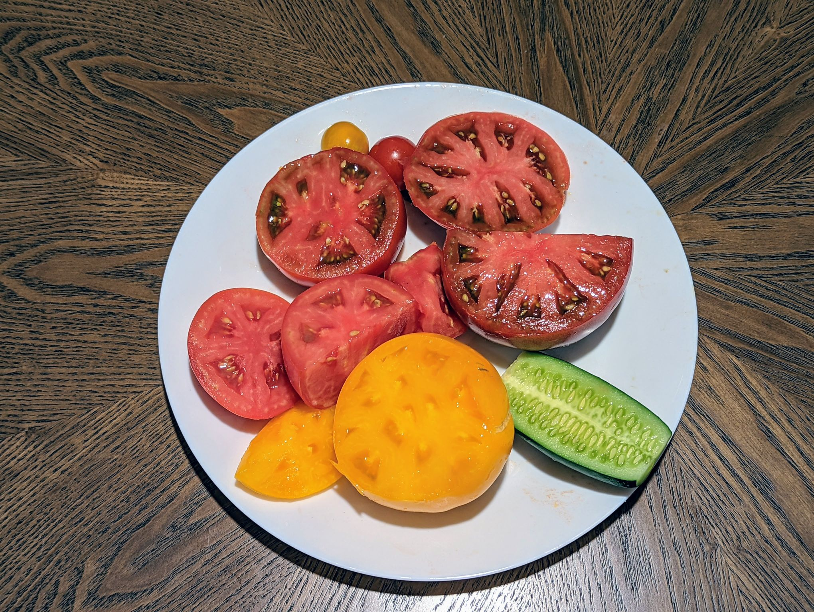
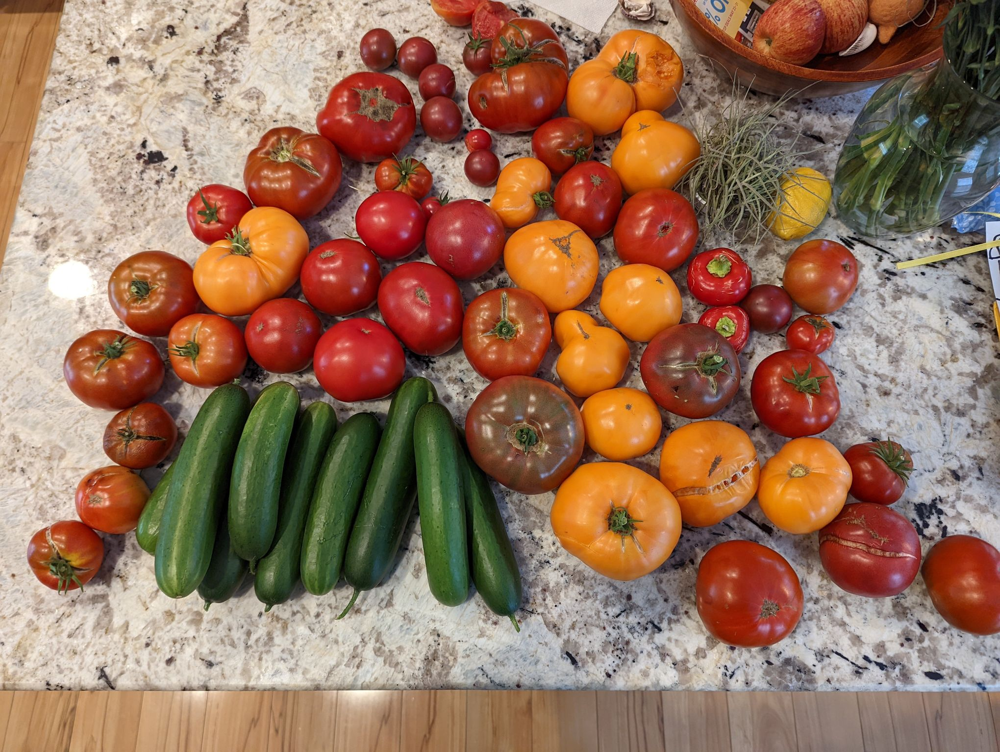
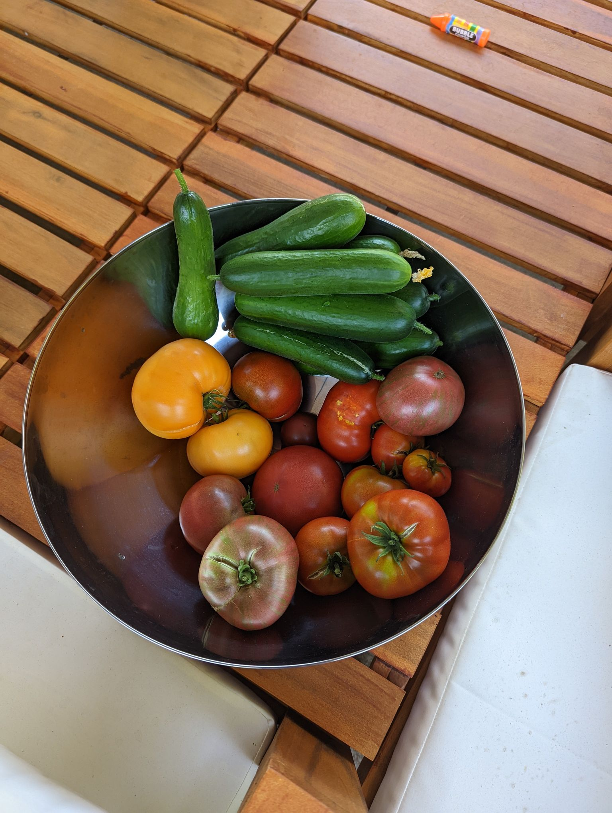
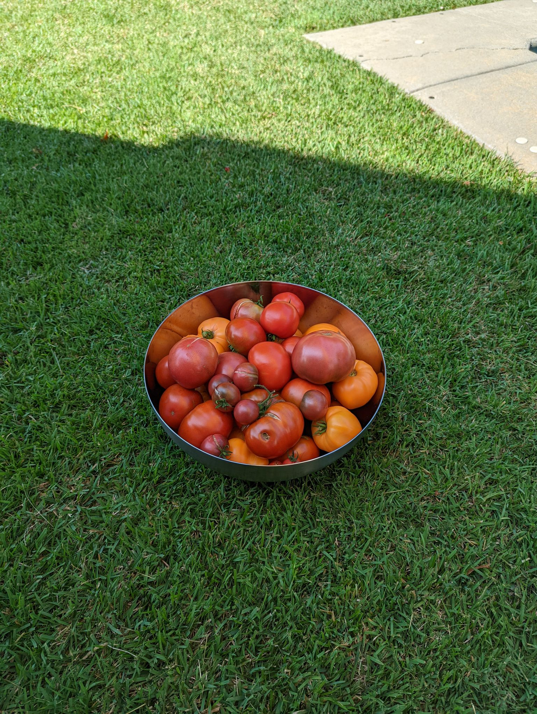
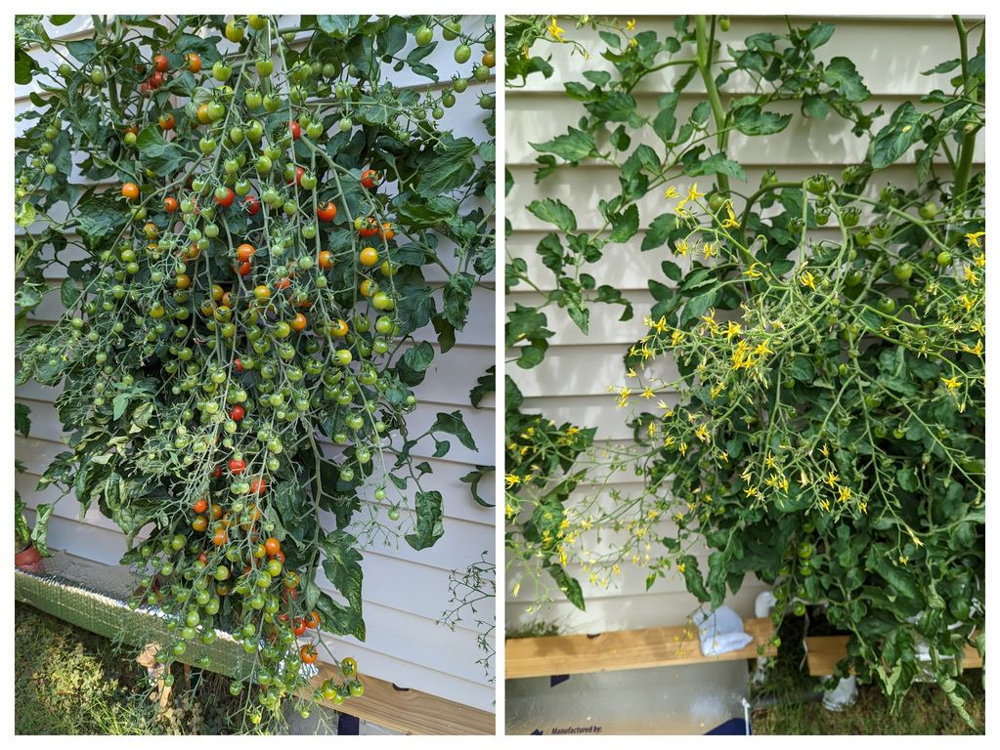
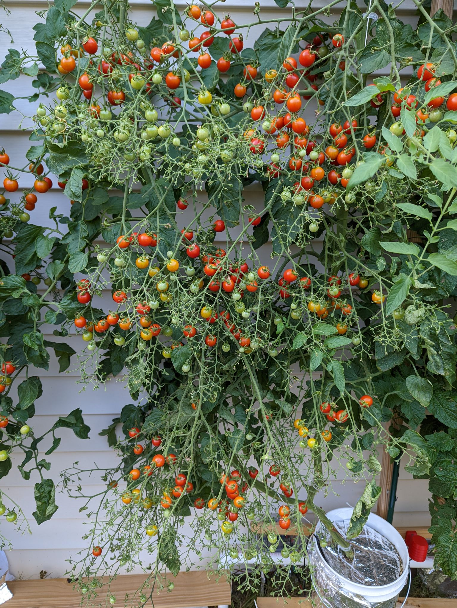

# Telegram: https://t.me/mole_garden

### Используя этот профиль это не гарантия успеха, нужно понимать что вы делаете и как.

## Автор профиля
@mole_garden

## Условия выращивания
Место: *Улица, Северная Каролина, осень, зима, весна.*

Свет: *Естественное освещение, солнце.*

Температура: *Температура изменяется часто и сильно от 0 до 25, в течение нескольких дней.*

Влажность: *Так же как и Температура, часто и сильно, от 100% до 50%, в течение дня.*

## Где и как найти дополнительную информацию

Искать результат выращивания зелени на этом профиле в канале по имени автора, а так же в персональном канале и [фотоальбоме](https://photos.app.goo.gl/V4bhtaWEnkZAifoWA)

## Стадии роста

### Рассада
Стадия рассады начинается с момента появления первых всходов и до 3-5 настоящего листа. Все очень сильно зависит от условий выращивания.
Профиль **start**

### Активный рост
После 5 настоящего листа, можно переводить на полноценное питание
Профиль **vega, vega_blooming**

### Плодоношение
Профиль **fruiting**

## Фото
<a href="img/t1.jpg">

</a>

